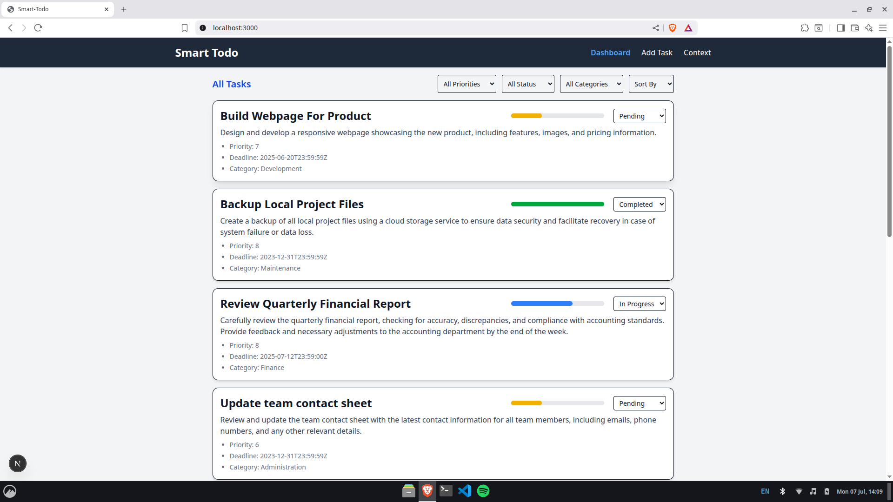
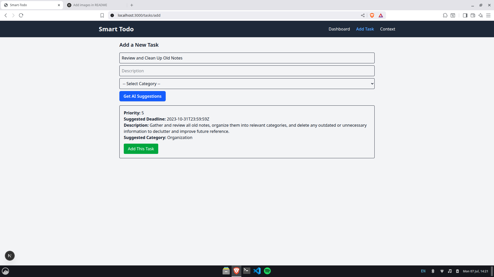
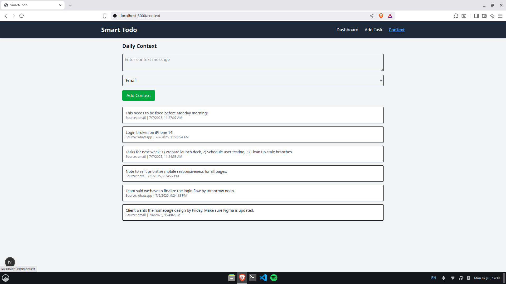

# Smart Todo List with AI

An AI-powered todo list application that helps you manage tasks more intelligently by leveraging contextual information (from emails, notes, WhatsApp, etc.) and AI-driven suggestions for task prioritization, deadlines, and categorization.


## UI

**Dashboard**



**Add Task with Sample AI Suggestion**


**Daily Context**



## Features
- **Task Management**: Create, update, and categorize tasks with priorities and deadlines.
- **Context Awareness**: Add daily context from various sources (email, note, WhatsApp) to inform AI suggestions.
- **AI Suggestions**: Get smart suggestions for task priority, deadline, improved description, and category using OpenRouter AI.
- **Modern UI**: Built with Next.js, React, and Tailwind CSS for a responsive, user-friendly experience.

---

## Project Structure
```
smart-todo-list-with-ai/
  client/    # Frontend (Next.js, React)
  server/    # Backend (Django, Django REST Framework)
```

---

## Getting Started

### Prerequisites
- **Node.js** (v18+ recommended)
- **npm** (v9+ recommended)
- **Python** (3.10+ recommended)
- **PostgreSQL** (for backend database)

---

## Backend Setup (Django)

1. **Install dependencies:**
   ```bash
   cd server
   python3 -m venv venv
   source venv/bin/activate
   pip install -r requirements.txt
   ```

2. **Configure environment variables:**
   - Create a `.env` file in `server/` with the following (replace with your actual OpenRouter API key):
     ```env
     OPENROUTER_API_KEY=your_openrouter_api_key_here
     ```
   - Ensure your PostgreSQL database is running and matches the settings in `server/todolist/settings.py`:
     - NAME: `smart_todo_ai`
     - USER: `bhaskar`
     - PASSWORD: `bhaskar`
     - HOST: `localhost`
     - PORT: `5432`

3. **Apply migrations:**
   ```bash
   python manage.py migrate
   ```

4. **Run the backend server:**
   ```bash
   python manage.py runserver
   ```
   The API will be available at `http://localhost:8000/api/`

---

## Frontend Setup (Next.js)

1. **Install dependencies:**
   ```bash
   cd client
   npm install
   ```

2. **Run the frontend development server:**
   ```bash
   npm run dev
   ```
   The app will be available at `http://localhost:3000`

---

## API Overview

### Task Endpoints
- `GET /api/tasks/` — List all tasks
- `POST /api/tasks/` — Create a new task
- `PATCH /api/tasks/<id>/` — Update a task (e.g., status)
- `GET /api/categories/` — List all categories
- `POST /api/categories/` — Create a new category

#### Example Task Payload
```json
{
  "title": "Finish quarterly report",
  "description": "Complete and submit the Q2 report to management.",
  "category_id": 1,
  "priority_score": 8,
  "deadline": "2025-07-10T17:00:00Z",
  "status": "pending"
}
```

### Context Entry Endpoints
- `GET /api/context/` — List all context entries
- `POST /api/context/` — Add a new context entry

#### Example Context Entry Payload
```json
{
  "content": "Finish quarterly report by Wednesday",
  "source": "email"
}
```

#### Example Context Data (Multiple Entries)
```json
[
  {
    "content": "Finish quarterly report by Wednesday",
    "source": "email"
  },
  {
    "content": "Don't forget to clean up workspace before meeting",
    "source": "note"
  }
]
```

### AI Suggestion Endpoint
- `POST /api/ai/suggest/`
  - Request body:
    ```json
    {
      "task": {
        "title": "Finish quarterly report",
        "description": "",
        "category_id": 1
      },
      "context": [
        { "content": "Finish quarterly report by Wednesday", "source": "email" },
        { "content": "Don't forget to clean up workspace before meeting", "source": "note" }
      ]
    }
    ```
  - Response example:
    ```json
    {
      "priority_score": 7,
      "suggested_deadline": "2025-07-15T17:00:00Z",
      "improved_description": "Your detailed improved or inferred description here.",
      "suggested_category": "Your suggested category here"
    }
    ```

---

## Environment Variables
- `OPENROUTER_API_KEY` (required for backend AI suggestions)

---

## Notes
- The backend must be running before starting the frontend for full functionality.
- The default database credentials are set for local development. Update them as needed for production.
- The AI suggestion feature requires a valid OpenRouter API key.

---
